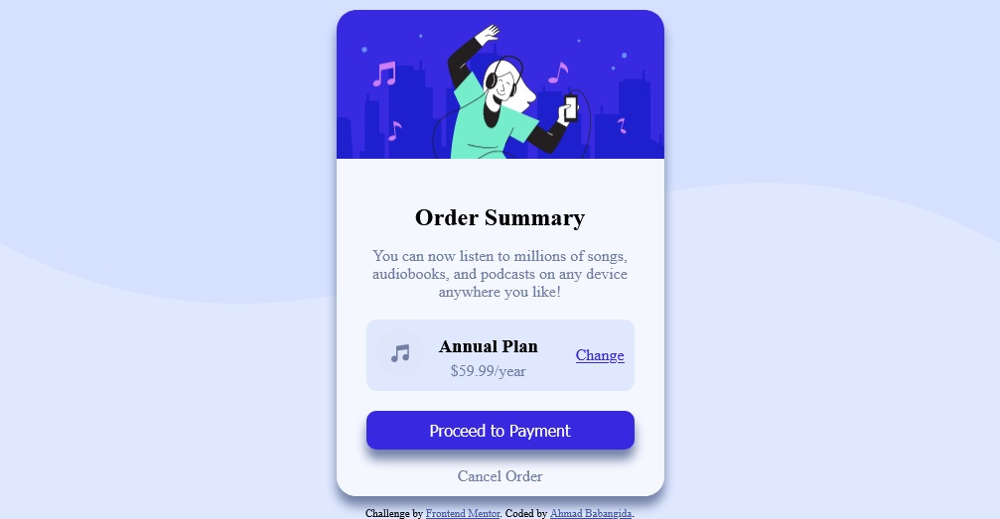

# frontend-mentor-solution-one
A mobile first solution to a challenge on Fronted mentor
# Frontend Mentor - Order summary card solution

This is a solution to the [Order summary card challenge on Frontend Mentor](https://www.frontendmentor.io/challenges/order-summary-component-QlPmajDUj). Frontend Mentor challenges help you improve your coding skills by building realistic projects. 

## Table of contents

- [Overview](#overview)
  - [The challenge](#the-challenge)
  - [Screenshot](#screenshot)
  - [Links](#links)
- [My process](#my-process)
  - [Built with](#built-with)
  - [What I learned](#what-i-learned)
  - [Continued development](#continued-development)
- [Author](#author)

## Overview
This is my first challange on Frontend Mentor and found uot that it is great starting with this project. I've made use of my css and flexbox skils to make the project come to live. Even though it is not 100% perfect, I've tried to solve the problem with minima effort. It took me not too long to complete the challange, not more than 24 hours.

### The challenge

Users should be able to:

- See hover states for interactive elements

### Screenshot



### Links

- Solution URL: [Add solution URL here](https://frontend-mentor-solution-one.vercel.app/#)
- Live Site URL: [https://frontend-mentor-solution-one.vercel.app/#](https://frontend-mentor-solution-one.vercel.app/#)

## My process

### Built with

- Semantic HTML5 markup
- CSS custom properties
- Flexbox
- Mobile-first workflow

### What I learned

I enhanced my flexbox skills with this project such as:

To see how you can add code snippets, see below:

```css
body {
  dispay: flex;
  align-items: center;
  justify-content: center;
  min-height: 100vh;
}
```

### Continued development

I wanted to use CSS Grid in this project, but it turned out that I only know CSS flex. So i will definately continue my journey in CSS Grid.

## Author

- Website - [Ahad Babangida](https://ahmatech.atwebpages.com)
- Frontend Mentor - [@ahmadktn](https://www.frontendmentor.io/profile/ahmadktn)

